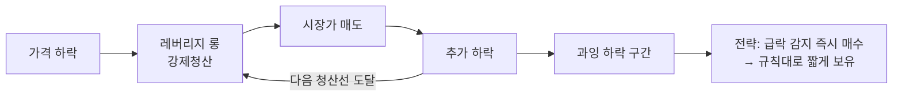
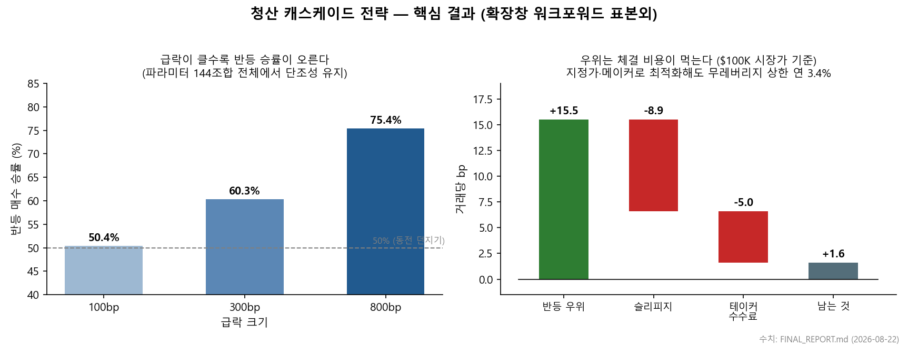

# 청산 캐스케이드 연구

연구 기간 2026-07 ~ 2026-08-22 · 결론: 자본 투입 근거 없음, 종료.

## 이 연구는 무엇인가

암호화폐 무기한선물에서 강제청산이 연쇄되는 순간을 사는 전략이 실제로 돈이 되는지
검증한 연구다. 레버리지 롱 포지션은 가격이 조금만 밀려도 강제청산되고, 강제청산은
곧 시장가 매도라서 가격을 한 번 더 민다. 밀린 가격이 다음 포지션들의 청산선을
건드리면 연쇄가 돈다. 이 몇 분 동안 가격은 펀더멘털과 무관하게 과잉 하락하므로
"그 바닥을 사면 되지 않나"라는 오래된 직관이 있다. 그 직관을 끝까지 계산했다.



답부터 적으면, 반등 우위는 통계적으로 실재한다. 다만 그 우위가 발생하는 순간의
호가창이 우위보다 얇다. 의미 있는 규모를 넣는 순간 체결 비용이 우위를 먹는다.

## 무엇을 가정했나

설계는 두 부분이었다.

1. 예측형 — 미결제약정(OI) 분포와 호가 깊이로 연쇄가 어디까지 무너질지 근사할 수
   있다면, 바닥 근처에 지정가를 깔아 둘 수 있다.
2. 반응형 — 예측이 안 되면 급락을 감지한 직후 시장가로 사서 규칙대로 짧게 보유한다.

급락 순간의 미시구조를 보려면 분봉으로는 부족하다는 가정 아래, 검증에 필요한
데이터를 직접 수집하기로 했다.

## 어떻게 했나

데이터부터 만들었다. Binance 무기한선물 21종의 1분봉 6년과 30초 호가깊이 3.5년에
더해, 1초 단위 호가 심도·고빈도 OI·청산 체결 스트림을 받는 수집기 8종을 구축해
45GB를 모았다.

검증 규칙은 세 가지였다. 파라미터는 매년 그 이전 데이터로만 고르는 확장창
워크포워드로 뽑았다. 시장이 오르는 동안은 아무 때나 사도 벌리므로, 같은 날 같은
종목에서 진입 시각만 무작위인 대조 거래 289,715개를 만들어 그 효과를 제거했다.
파라미터 격자 144칸 전체를 확인하고 다중검정 보정을 걸어 우연히 좋은 칸 하나를
잡는 일을 막았다. 용량은 이론값이 아니라 급락 순간의 실제 호가 잔량으로 실측했다.

## 무엇이 나왔나



반응형의 현상은 실재했다. 워크포워드 표본외에서 거래당 +15.5bp가 남았고 무작위
대조군보다 거래당 +22.7bp 좋았다(t=11.2). 급락이 클수록 승률이 100bp 50.4%에서
800bp 75.4%까지 예외 없이 올라간다. 손익비는 0.94로 우위는 전부 승률에서 나오는
구조이고 개별 최악 거래는 −41%였다.

예측형은 기각됐다. OI 청산맵의 증분 설명력은 사실상 0이었고(R² +0.005) 호가 깊이와
주문 유입·취소 흐름도 다르지 않았다. 바닥 위치를 직접 맞히는 회귀도 설명력 1~7%에
그쳤다. 어디가 바닥인지 예측할 수 없고, 예측할 필요 없이 즉시 사는 쪽이 낫다.

문제는 체결이다. 이 전략이 사는 시점은 정확히 모두가 팔고 유동성이 사라지는
시점이라, 급락 순간 매도호가 1% 이내 잔량이 평시의 63%(중앙값 약 $98만)로 얇아진다.
$100K 시장가 주문만으로 왕복 슬리피지가 8.9bp — 우위의 절반이 증발한다. 테이커
수수료 5bp가 또 3분의 1을 깎는다. 지정가·메이커 수수료로 최적화해도 무레버리지
수익 상한이 연 3.4%로 무위험 수익률 수준이다.

## 결론

우위는 있었지만 호가창보다 작았다. 실거래 자본 투입 근거 없음으로 판정하고 연구를
종료했다.

검증 과정에서 백테스트 결함도 하나 나왔다. 중간 버전에서 샤프 2.38이 나왔는데,
추적해 보니 진입한 봉을 손절 검사에서 빼먹은 버그가 만든 숫자였고 수정하자
성과는 사라졌다. 이 사례는 지우지 않고 FINAL_REPORT 첫머리에 남겨 두었다. 급락
직후 시장가 진입을 가정한 백테스트는 체결 비용을 넣는 순간 결과가 뒤집힐 수
있다는 것이 이 연구의 부수 결론이다.

한계도 있다. 1초 웹소켓 데이터는 수집 기간이 3주(2026-08-02~22)뿐이라 그 사이
대형 캐스케이드를 관측하지 못했다. 급락 후 회복하지 못하고 사라진 종목은 표본에서
빠지므로 생존자 편향이 있고, 이를 교정하면 결론은 더 나빠지는 방향이다.

## 저장소 구조

```
FINAL_REPORT.md     결론과 근거 — 이 연구의 최종 문서
analysis/           분석 스크립트 + 단계별 결과 문서(FINDINGS)
collectors/         실시간 수집기 8종 (1초 호가·OI·청산 스트림)
downloaders/        과거 데이터 다운로더
docs/               연구 과정 기록 (설계 원문·시간순 로그·중간 모델 문서)
assets/             README 그림
```

원데이터 45GB는 거래소 데이터 재배포 문제로 포함하지 않았다. 수집기와 다운로더로
같은 구조를 재구축할 수 있다.

주의: `analysis/fast_trigger.py`와 `analysis/asymmetry.py`는 진입 봉 처리에 결함이
있는 초기 스크립트다. 두 파일의 손절 포함 결과는 정확하지 않다 — 상세는
FINAL_REPORT의 산출물 표 참조.
